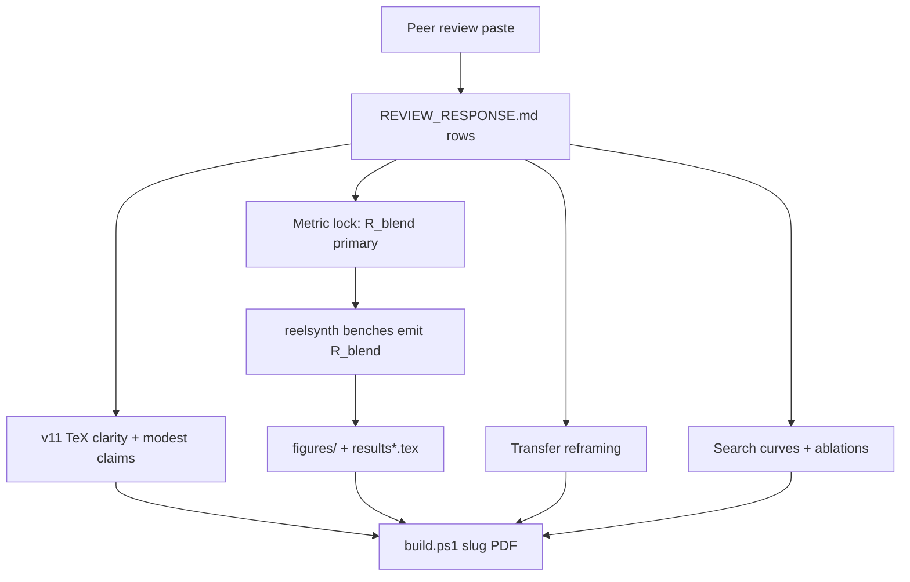

# Spec: paper-v11-peer-review-response

Technical how-to-build from `requirements.md`. No feature code in this file.

## Approach (locked)

Answer the peer review by **(1)** fixing the metric mix-up in all reader-facing text, **(2)** clarity + modest framing pass, **(3)** reframe transfer as wrap-protocol stress tests (default; appendix/delete only if user picks that gate), **(4)** add search-curve + branch-ablation evidence from existing artifacts where possible, **(5)** regenerate \(R_{\mathrm{blend}}\) boards only where scripts already exist and budget allows — never invent scores.

## Architecture

## Key paths

| Area | Path |
|------|------|
| Paper | `paper/Unsupervised_Wavetable_Seam_Artifact_Repair_via_Hybrid_GA-PPO_Meta-Search_v11/` |
| Protocol | `…/EVAL_PROTOCOL.md`, `NOMENCLATURE.md` |
| Response map | `…/REVIEW_RESPONSE.md` (create) |
| TeX hot spots | `main.tex`, `subsections/{introduction,methods,related_work,results,results_transfer,discussion,limitations,conclusion}.tex` |
| Search curves | `reelsynth/brand/artifacts/meta_approach_compare/` + `scripts/plot_overnight_history.py` / v10 hybrid JSON |
| Ablations | `denoise-opt-meta/artifacts/models/ablate-*` or reelsynth mirrors |
| N2N / favorite sizes | `n2n_seam_baselines/`, fitted champion JSON under `gpu-rl-arch-*` |
| Transfer | `reelsynth/brand/artifacts/signal_heal_transfer/` |

## Workstreams

### W1 — Review map + synopsis correction
- Create `REVIEW_RESPONSE.md` with columns: Review item | Verdict (agree/partial/disagree+why) | Action | Location.
- First rows: synopsis metric error; bake-cell → repair operator.

### W2 — Clarity / structure (US-1, US-2)
- Acronym pass; keep Terminology; slim Methods cross-refs.
- Soften contribution language; keep problem-framing as the crisp novelty.
- Related Work: used vs screened already clarified; ensure motivation paragraphs not laundry lists.

### W3 — Metric lock (US-3)
- Sweep “historical context only” language.
- Inventory boards; regenerate \(R_{\mathrm{blend}}\) where cheap; else appendix + “incomplete until regen.”
- Primary story always `tab:n2n-vs-ours`.

### W4 — Transfer (US-4)
- Default: keep seven boards; add mechanistic wrap analogy + stress-test disclaimer.
- Domain analysis: one short paragraph each (bearing rev, ECG beat, synth CNC/PMU).
- User may gate appendix-only / delete.

### W5 — Stats + fairness (US-5)
- Param table: Θ favorite vs SeamN2N.
- Error bars on primary \(R_{\mathrm{blend}}\) where multi-seed exists; document single-run boards honestly.
- Restate seed firewall.

### W6 — Curves + ablations (US-6, US-7)
- Plot champion vs evaluations (hybrid + Random minimum).
- Prefer \(R_{\mathrm{blend}}\)/ \(J\) from v10.1 search; if only prolonged \(R\) logs exist, caption **superseded metric** and schedule regen — do not fake.
- Branch ablation table from ablate-* runs or bounded re-bench.

### W7 — Ship (US-8)
- `build.ps1`, CHANGELOG, push both repos.

## Risks and honesty

| Risk | Mitigation |
|------|------------|
| Reviewer numbers already circulating | Explicit fact-check table in REVIEW_RESPONSE + intro |
| Cannot regen all boards this cycle | Incomplete list in Limitations; no silent retag |
| Transfer still feels arbitrary | Mechanistic paragraphs or demote |
| Curves only on prolonged \(R\) | Label superseded; optional re-search under \(R_{\mathrm{blend}}\) as follow-up task |

## AC → spec mapping

| AC | Spec element |
|----|----------------|
| AC-1.* | W2 prose + REVIEW_RESPONSE clarity row |
| AC-2.* | W2 modest framing |
| AC-3.* | W3 metric lock |
| AC-4.* | W4 transfer |
| AC-5.* | W5 stats |
| AC-6.* | W6 curves |
| AC-7.* | W6 ablations |
| AC-8.* | W7 ship + REVIEW_RESPONSE completeness |

## Deferred (explicit)

- Full \(R_{\mathrm{blend}}\) re-search of matched 5k outer-loop bake-off (unless open Q2 budgets it).
- Human listening / deep domain SOTA.
