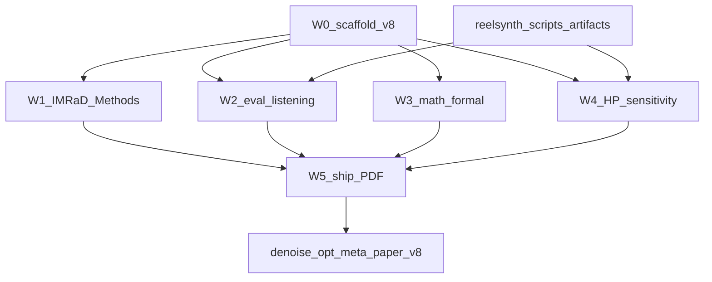

# Design: paper-v8-review-response

Technical design for DenoiseOpt paper **v8** (review response + gap closure). Implements locked paper plan **1A + 2B** (W0–W5). Obeys [`docs/sdd/CONSTITUTION.md`](../../CONSTITUTION.md) and [`requirements.md`](requirements.md).

**Status:** Gate C accepted (user Build, 2026-07-24). Grill-me-plan-loop completed INTERNAL ×3; decisions **LOCKED** (no open options).

---

## Approach (locked)

| Choice | Why |
|--------|-----|
| Copy `paper/v7/` → `paper/v8/`; leave v7 archived | Clean version boundary; review response is a full rewrite, not in-place edit of frozen v7 PDF. |
| Slim Methods + Algorithms 1–9 → appendix + overview TikZ | Addresses clarity weakness without inventing new science. |
| Fold existing 5k meta / bars / heals / hear packs; **do not** re-run or wipe `meta_approach_compare/` | Constitution §5; AC-3.4 / AC-4.3. |
| New scripts only for vibrato + HP sensitivity; WT gallery from **existing** exports | Honest budget; no new NAS for diversity. |
| Primary claim = cycle-local wavetable seam restoration; CWRU/ECG appendix classical-board | Constitution §1 / §4. |

---

## Architecture / data flow

**Repos:**

| Role | Root |
|------|------|
| Manuscript | `denoise-opt-meta/paper/v8/` |
| Experiment scripts | `reelsynth/scripts/` |
| Publishable artifacts | `reelsynth/brand/artifacts/` |
| Mirror pointer | `reelsynth/docs/papers/denoise_opt/README.md` |
| Transfer pilot prose source | `denoise-opt-meta/docs/SIGNAL_HEAL_TRANSFER_PILOT.md` (+ reelsynth mirror under `docs/papers/denoise_opt/`) |

---

## Workstreams W0–W5

### W0 — Scaffold (`paper/v8/`)

**Actions**

1. Copy `denoise-opt-meta/paper/v7/` → `denoise-opt-meta/paper/v8/` (preserve figures JSON already folded from post-review assets).
2. Update pointers:
   - `denoise-opt-meta/paper/main.tex` → comment/path to `paper/v8/`
   - `denoise-opt-meta/paper/CHANGELOG.md` — v8 entry
   - `denoise-opt-meta/paper/v8/TITLES.md` — drop stale “v6” strings
3. Create `denoise-opt-meta/paper/v8/REVIEW_RESPONSE.md` skeleton: one row per review weakness / author Q / suggestion → target v8 section/figure/table (fill locations as W1–W5 land).

**Key paths**

- `denoise-opt-meta/paper/v8/main.tex`
- `denoise-opt-meta/paper/v8/subsections/*.tex`
- `denoise-opt-meta/paper/v8/figures/` (retain v7 copies of `meta_approach_compare.json`, `fig_meta_heal_samples.json`, bars/heal PNGs if present, `real_wt_matrix.json`, …)
- `denoise-opt-meta/paper/v8/REVIEW_RESPONSE.md`

---

### W1 — Clarity / IMRaD Methods (AC-1.*)

**Actions**

1. Slim `paper/v8/subsections/methods.tex`: problem → ideal sibling → $R$ → bake cell $\Theta$ → hybrid loop overview → hyperparams.
2. New `paper/v8/subsections/appendix_algorithms.tex`: move Algorithms 1–9 out of body; keep ≤2 short in-body sketches if flow needs them.
3. Overview TikZ before component deep-dives — extend or replace `paper/v8/subsections/arch_diagram.tex`.
4. Consistent display names: Random NAS, Cont. CMA-ES, Arch REINFORCE, Aging evolution, TPE Bayes NAS, Ours.
5. Separate paragraphs/equations: outer objective $\max R(y,r^{\star})$ vs PPO advantage centering $R - R_{\mathrm{DualCosine}}$ (see W3).
6. Tighten Abstract / Intro to constitution scope (no speech-enhancement / deep-SOTA overclaim).

**Key paths**

- `paper/v8/main.tex` (input order; appendix include)
- `paper/v8/subsections/methods.tex`
- `paper/v8/subsections/appendix_algorithms.tex` (**new**)
- `paper/v8/subsections/arch_diagram.tex`
- `paper/v8/subsections/introduction.tex`

---

### W2 — Eval + listening + WT diversity (AC-3.*)

**Actions**

1. **Vibrato / dynamic pitch (new):** `reelsynth/scripts/bench_vibrato_spectrogram.py` (name locked)
   - Render prolonged cracked vs DualCosine vs Ours under slow vibrato / modulated tiling.
   - Emit spectrogram difference figure + mean $R$ under modulation.
   - Write artifacts to `reelsynth/brand/artifacts/vibrato_spectrogram/` and copy publishable figure into `paper/v8/figures/` (e.g. `fig_vibrato_spectrogram.pdf` / `.png` + JSON).
2. **Hear pack (existing):** cite `reelsynth/brand/artifacts/meta_approach_compare/hear_samples/` (5 tiles; rebuild via `scripts/export_meta_hear_samples.py`). Paper panel figure + short Results paragraph; document WAV path in caption / tooling.
3. **WT diversity (LOCKED — no new NAS):** compact gallery from existing ReelSynth export + OA AKWF matrices already scored by `scripts/real_wt_wrap_protocol.py` / `brand/artifacts/real_wt_cycles/` and folded `paper/v7/figures/real_wt_matrix.json` → v8 figure panel (waveform strips or matrix highlight). Do **not** launch new meta searches for diversity.
4. **Transfer appendix:** fold `docs/SIGNAL_HEAL_TRANSFER_PILOT.md` + `brand/artifacts/signal_heal_transfer/` into appendix with **classical-board / not deep SOTA** disclaimer.
5. Fold existing 5k meta bars/table/heals from v7 figures — **do not re-run** `bench_meta_approaches_5k.py` for this AC.

**Key paths**

| Asset | Path |
|-------|------|
| Vibrato script | `reelsynth/scripts/bench_vibrato_spectrogram.py` |
| Vibrato artifacts | `reelsynth/brand/artifacts/vibrato_spectrogram/` |
| Hear WAVs | `reelsynth/brand/artifacts/meta_approach_compare/hear_samples/` |
| Hear presets | `reelsynth/brand/artifacts/meta_approach_compare/hear_presets/` |
| Hear export | `reelsynth/scripts/export_meta_hear_samples.py` |
| Real WT protocol | `reelsynth/scripts/real_wt_wrap_protocol.py` |
| Real WT artifacts | `reelsynth/brand/artifacts/real_wt_cycles/` |
| Real WT matrix (fold) | `paper/v8/figures/real_wt_matrix.json` |
| Transfer pilot doc | `denoise-opt-meta/docs/SIGNAL_HEAL_TRANSFER_PILOT.md` |
| Transfer scores | `reelsynth/brand/artifacts/signal_heal_transfer/` |
| Paper figures out | `paper/v8/figures/` |

---

### W3 — Math formalization (AC-2.*)

**Actions**

1. Notation / Methods: formal bake operator $\Theta : \mathbb{R}^{L}\times\mathcal{H}\to\mathbb{R}^{L}$ (or equivalent).
2. Ideal sibling: $r^{\star}=G(\mathrm{seed},\mathrm{cliff=off})$ vs cracked $x=G(\mathrm{seed},\mathrm{cliff=on})$ — same draw, cliff withheld (not latent studio GT). Cite generator in overnight/bench code (`overnight_gpu_rl_arch.py` / FitCell batch makers).
3. Single outer objective: $\max R(y,r^{\star})$, $y=\Theta(x;h)$.
4. Remark (Q2): DualCosine centering is **advantage baseline only**; does not change ranking objective.
5. Fix Fig.1 / no-bake captions: distinguish no-bake, DualCosine, ideal, Ours.
6. Answer Q1–Q2 in Methods + `REVIEW_RESPONSE.md` rows.

**Key paths**

- `paper/v8/subsections/methods.tex`
- `paper/v8/subsections/arch_diagram.tex` / intro figure captions
- `paper/v8/NOMENCLATURE.md` (align if present)
- Generator citation: `reelsynth/scripts/overnight_gpu_rl_arch.py`

---

### W4 — HP ±50% sensitivity (AC-4.*) — LOCKED protocol

**Script:** `reelsynth/scripts/bench_meta_hp_sensitivity.py`  
**Out dir:** `reelsynth/brand/artifacts/meta_hp_sensitivity/`  
**Seed:** `1902771841` (same as `overnight_gpu_rl_arch.DEFAULT_SEED` / meta compare)

**Protocol (LOCKED)**

| Knob | Value |
|------|--------|
| Budget | **500** outer iters per config |
| Design | **One-at-a-time** ±50% (not full factorial) |
| Baseline | Table~\ref{tab:hyperparams} / v7 Table-2 defaults |
| Perturbed HPs | `pop_size` (12), `ppo_clip` (0.2), fit `lr` ($3{\times}10^{-3}$), GA mutation / explore intensity (mutation second-hit rate or equivalent explore coef exposed by hybrid runner), entropy_coef (0.02) as secondary if cheap |
| Protocol cell | sine+cliff / FitCell matched to meta compare defaults (batch 48, fit_steps 24) |
| Honesty label | **Sensitivity probe**, not a full 5k re-search per HP |
| Forbidden | Any wipe/modify of `brand/artifacts/meta_approach_compare/` |

**Outputs**

- `meta_hp_sensitivity/REPRO_MANIFEST.json` + `REPRO.md`
- `meta_hp_sensitivity/results.json` (champion $R$ mean/var vs default)
- Figure/table → `paper/v8/figures/` + Results prose answering **Q3**
- `REVIEW_RESPONSE.md` Q3 row

---

### W5 — Ship (AC-5.*)

**Actions**

1. Update Results / Discussion / Limitations for review narrative without overclaiming.
2. Rebuild `paper/v8/main.pdf` (`pdflatex` × needed passes).
3. Finalize every `REVIEW_RESPONSE.md` row.
4. Point `reelsynth/docs/papers/denoise_opt/README.md` at **v8** (currently stuck on v5).
5. Commit + push **both** `denoise-opt-meta` and `reelsynth` when implement finishes.

**Key paths**

- `paper/v8/main.pdf`
- `paper/CHANGELOG.md`, `paper/main.tex`, `paper/v8/TITLES.md`
- `paper/v8/REVIEW_RESPONSE.md`
- `reelsynth/docs/papers/denoise_opt/README.md`
- New reelsynth scripts + `brand/artifacts/{vibrato_spectrogram,meta_hp_sensitivity}/`

---

## AC → design element map

| AC | Design element | Workstream |
|----|----------------|------------|
| AC-1.1 | Slim Methods + `appendix_algorithms.tex` + overview TikZ | W1 |
| AC-1.2 | Display-name pass; objective vs DualCosine paragraphs | W1 + W3 |
| AC-1.3 | Abstract/Intro scope edit | W1 |
| AC-2.1 | Formal $\Theta$, $G(\cdot)$ cliff on/off | W3 |
| AC-2.2 | $\max R$; Q1–Q2 in Methods + REVIEW_RESPONSE | W3 |
| AC-2.3 | Fig.1 / no-bake caption fixes | W3 |
| AC-3.1 | `bench_vibrato_spectrogram.py` + `paper/v8/figures/` | W2 |
| AC-3.2 | Hear panel + WAV path docs | W2 |
| AC-3.3 | Transfer pilot appendix + classical-board disclaimer | W2 |
| AC-3.4 | Fold v7 meta/bars/heals JSON/figures; no re-run | W0/W2 |
| AC-4.1 | `bench_meta_hp_sensitivity.py` → `meta_hp_sensitivity/` seed 1902771841 | W4 |
| AC-4.2 | Champ-$R$ table/figure; Q3 in Results + REVIEW_RESPONSE | W4 + W5 |
| AC-4.3 | Write only under `meta_hp_sensitivity/`; never touch compare tree | W4 |
| AC-5.1 | PDF + CHANGELOG + pointer + TITLES | W0 + W5 |
| AC-5.2 | Complete REVIEW_RESPONSE rows | W0 skeleton → W5 complete |
| AC-5.3 | Mirror README v8; dual-repo push | W5 |

---

## Grill-me-plan-loop (INTERNAL ×3) — LOCKED

Calibration: Expert / Hard (paper + experiment owners; decisions pre-specified by SDD Gate C brief). Interactive Q&A skipped; each pass pressure-tested the three Gate-C foci and wrote locks below.

### Pass 1 — Ambiguities (HP budget honesty vs Q3 strength)

| Question pressed | Decision LOCKED |
|------------------|-----------------|
| Is 500 iters enough to “justify” meta-search? | Yes **as sensitivity evidence**, not as a second 5k campaign. Paper must state: one-at-a-time ±50% at 500 iters measures local robustness of Table-2 HPs under seed `1902771841`; it does **not** re-prove the 5k ranking. |
| Full grid vs OAT? | **OAT only** — avoids combinatorial blow-up; Q3 asks ±50% sensitivity, not interaction surfaces. |
| Which HPs? | Key Table-2 / `tab:hyperparams` knobs: `pop_size`, `ppo_clip`, fit `lr`, mutation/explore intensity (+ entropy if cheap). |
| Output location? | `reelsynth/brand/artifacts/meta_hp_sensitivity/` only. |

### Pass 2 — Tradeoffs / execution (listening claim strength)

| Question pressed | Decision LOCKED |
|------------------|-----------------|
| Formal human A/B study? | **OUT OF SCOPE** (requirements). No IRB, no claimed listening scores. |
| What ships for “listening”? | (1) Spectrogram / vibrato figure, (2) downloadable hear WAVs, (3) paper panel citing those paths. |
| Informal A/B wording? | Allowed only as optional protocol **note**; **no formal A/B claim** in Abstract/Results. Prefer “audible examples + spectrograms.” |
| Risk if overclaim? | Reviewer pushback → violate Constitution §1. Mitigate with explicit Limitations sentence. |

### Pass 3 — Failure modes / validation / reversibility (WT diversity)

| Question pressed | Decision LOCKED |
|------------------|-----------------|
| New NAS for “real WT”? | **No.** Gallery from existing ReelSynth export + AKWF / `real_wt_matrix.json` only. |
| How much is enough? | **Compact gallery** (small multi-cycle panel or matrix highlight) proving diversity beyond single sine+cliff narrative — not a new SOTA matrix campaign. |
| Rollback if gallery thin? | Still ship matrix citation + 3–6 representative cycles; never start fresh meta runs in v8 scope. |
| Irreversible mistake? | Wiping `meta_approach_compare/` — **forbidden**; sensitivity/vibrato write to sibling dirs. |

### Rejected alternatives (all passes)

| Rejected | Why |
|----------|-----|
| Full 5k × each HP | Budget dishonest; violates “sensitivity not re-search” |
| Spectrogram-only (no WAVs) | Fails AC-3.2 / reviewer listening ask |
| Formal MOS / A/B study in v8 | Out of scope; would block ship |
| New NAS for WT diversity | Out of scope; existing exports suffice for compact gallery |
| In-place edit of v7 | Breaks version archive; plan locks v8 folder |

### Open options after grill

**None.** Implement may proceed under `tasks.md`.

---

## Risks & honesty

| Risk | Mitigation |
|------|------------|
| Q3 overread as full HP optimality proof | Label sensitivity; cite 5k compare as ranking evidence separately |
| Informal listening misread as formal study | Explicit OUT OF SCOPE + Limitations |
| Accidental compare wipe | Separate artifact roots; scripts must refuse `--out` under `meta_approach_compare/` for sensitivity |
| Transfer appendix overclaim | Classical-board disclaimer required (AC-3.3) |
| Dual-repo drift | W5 checklist: both remotes pushed; mirror README = v8 |

---

## Research / asset notes

- Post-review fold-ins (no re-run): `paper/v7/figures/meta_approach_compare.json`, `fig_meta_heal_samples.json`, `REPRO_MANIFEST_meta_compare.json`, hear packs under `meta_approach_compare/hear_{samples,presets}/`.
- Transfer pilot: `docs/SIGNAL_HEAL_TRANSFER_PILOT.md`.
- OA bibliography rule unchanged (Constitution §2).

---

## Validation (design-level)

Design is done when: every AC maps above; grill locks recorded; concrete paths exist for W0–W5; out-of-scope items match requirements. Implementation validation is per-task DoD in `tasks.md`.
